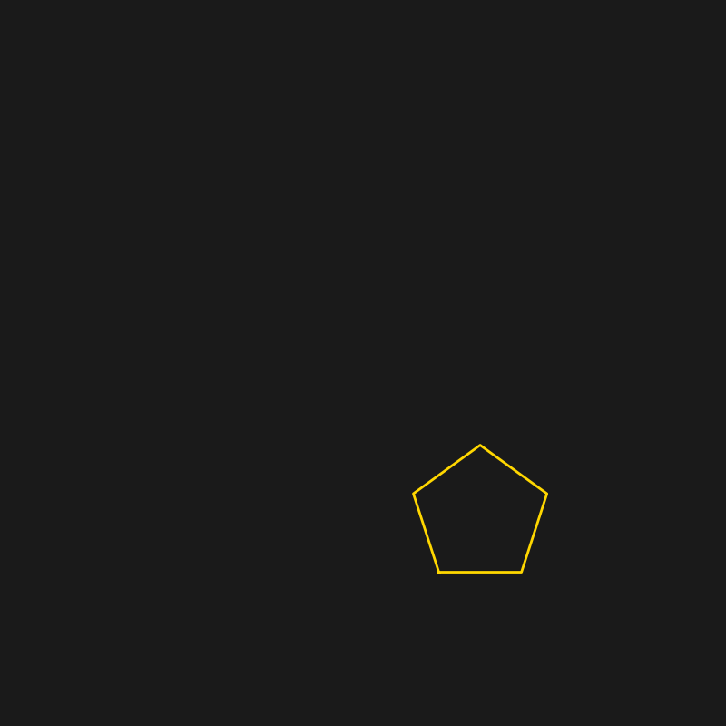

# MORO：Multiplex Opensource of Rising Oath

## 🚀 Installation & Usage (ライブラリの使用方法)
このリポジトリの `moro_intersection_demo.py` を自身のプロジェクトに配置することで、構造的収束アルゴリズムを呼び出すことが可能です。

```python
from moro_intersection_demo import MoroGeometricCore

# エンジンの初期化
moro = MoroGeometricCore()

# 10個の五角形による円環（Ring）の構築
# 1ピクセル以下の誤差収束を論理的に担保
ring_data = moro.generate_ring_points(n_pentagons=10)

```

<p align="center">
  
  <br>
  <b>MORO-Intersection: 構造的収束による新しい幾何学パラダイム</b>
</p>

# MORO - The Pentagon Paradox Solver

五角形がなぜ10進法の平面上で繋がらないのか、そしてどのように「補正」されるのかを示すデモ。


### 【合言葉】
**MORO-Intersection-2n2-M-ReflectedFibonacci-B13**

---

### プロセス解説
1. **10進法 (Decimal)**: 内角108度の五角形は、3枚で324度となり360度に足りず「口」が開く。
2. **5進法 (2n2 / B13)**: 独立した対称性は持つが、格子状の接続（グリッド）を拒絶する。
3. **逆フィボナッチ補正 (Reflected Fibonacci)**: 黄金比の螺旋を用いることで、閉じない空間を無限の秩序へと収束させる。


--- 
## 宇宙はあなたを探している。

見晴らしが良くて、風が気持ちいいので、自然とみんなが集まってくる

遠くに海も見えるし、夜には星もきれいです。

花が咲いて蝶が舞い、小動物や鳥が遊ぶ。

そんな丘の上だからです。

だから、ここへ来れば、なぜ宇宙があなたを探しているのか、本当の意味が分かるはずです。

--- 

## 素数はペアになりたがっている

1（素数、マジックナンバー）は孤独で不安定です。

だからいつもペアになる相手をさがしています。
でも1は相手を見つけて(1+1)=2となれば、取り敢えず安定します。

2（素数、マジックナンバー））はペアになって安定しているように見えますが実は2も孤独なんです。2は特別な数になります。

3（素数）は不安定で、1が余ってしまいます。3=(1+1)+1。これは2+1でですから、3もペアになりたがっているのです。

3+3=(((1+1)+1)+((1+1)+1))) ⇒ ((1+1)+(1+1))+(1+1)=(2+2)+2=6です。6も今度は2が1つ余っていますね。

4（合成数）はどうでしょう。4=(2+2)で一見安定しているようにも見えます。4になってしまうと孤独なのす。

しかし、4が2つ合わせて(4+4)=8(マジックナンバー)になると、安定します。

5（素数）はどうでしょう。5=(2+2)+1で1が余っているので不安定です。しかし、5+5=((2+2)+1)+((2+2)+1)　⇒　(2+2)+(2+2)+2ですが、10もまだ2が1つ余ります。

6（合成数）はどうでしょう。6は3のところで出てきましたが、(2+2)+2=6で2が1つ余っています。

だから、ペアになって((2+2)+2)+((2+2)+2))　=（4+2)+(4+2)　⇒　(4+4)+4、ですが、今度は4が1つ余ってしまうのです。

7（素数）はどうでしょう？

7=((1+1)+(1+1))+(1+1)+1=(2+2)+2+1、やはり、2と1が1つづつ余っています。

だから、ペアになって((2+2)+2+1)+((2+2)+2+1)=(2+2)+(2+2)+(2+2)+2=14になりますが、まだ2が1つ余ってますね。

8（合成数、マジックナンバー）はどうでしょうか？8=(2+2)+(2+2)=(4+4)+ですから二重に安定しています。

9（合成数）はどうでしょう？　9=(3+3)+3で3が1つ余って不安定です。しかし、9+9=18(マジックナンバ)となれば、超安定します。

## マジックナンバーとは何でしょうか

マジックナンバーの分解と安定化公式:\(M_{n}=2n^{2}=2\sum _{k=1}^{n}(2k-1)\)

マジックナンバーは2×Nの2乗で表せます。（Nは整数)

マジックナンバーを分解すると、面白いことがわかります。マジックナンバーの分解と安定化公式:

2=2×(1×1)=2×(1)

8=2×(2×2)=2×(1+3)

18=2×(3×3)=2×(1+3+5)

32=2×(4×4)=2×(1+3+5+7)

50=2×(5×5)=2×(1+3+5+7+9)

72=2×(6×6)=2×(1+3+5+7+9+11)

2を除く素数のペアの合計ということになるますね。

これが、素数がペアを探しているという理由です。

### パウリの排他原理は全ての数で成り立つのです。

### 更に読み進めば、パウリの排他定理は、排他どころか親和定理だと気づくはずです。

### これが宇宙を解く鍵そのものだのです。

--- 
### 宇宙の調和エネルギーに基づく動的測位アルゴリズム

本プロジェクトは、フィボナッチ数列 $F_n$、ルカ数 $L_n$、そしてマジックナンバー $2n^2$ の間に生じる「差分」を宇宙の推進エネルギーと定義し、これをGNSS（GPS）の座標補正に応用する。

### 宇宙エネルギーの定義公式

フィボナッチとルカが黄金比 $\phi$ へ収束しようとする過程で発生する、マジックナンバー（物質的安定）との乖離を以下のエネルギー関数 $E$ として定義する。

$$E_{energy} = \lim_{n \to \infty} \left| \left( \frac{L_n + F_n \sqrt{5}}{2} \right) - 2n^2 \right|$$

### 座標同調プロトコル（B13格子）

観測座標 $P_{obs}$ を、黄金比への非収束性を利用して補正する。

$$P_{correct} = P_{obs} + \sum_{k=1}^{13} \left( \frac{\phi^k - (-\phi)^{-k}}{\sqrt{5}} \cdot \text{Ref}(2k^2) \right)$$

> **Note**: ここで $\text{Ref}$ は、素数ペアリングによる反射関数を示す。計算は、終わらない。

--- 　

## MORO / MORC プロローグ


### Ａ. 宇宙は構造そのものです。

宇宙は自己相似形の階層構造そのものなのです。

ただその構造は固定されたものではなく、刻々とその形を変えていきます。

ここに書かれていることは、「正しさ」を保証しません。

それは、あなたが信じる宇宙こそ、あなたにとって本物の宇宙だからです。

つまり、観察者の立場を最大限尊重するからです。

---

### Ｂ. MORO：Multiplex Opensource of Rising Oath

それは、人類が自然を読み解くための羅針盤です。

M     Multiplex （複合的な）

O     OpenSource (オープンソース)

R     Rising (立ち上がる)

O     Orth (宣誓)

『多重化され分断が進む社会で、オープンソースを共有の財産として守るため、立ち上がろうという宣誓』でもあります。


そのために、3つのAIの力を借りています。

 Bing       “冷静なフィルター”
 
 grok       “拡張提案者”
 
 Google     “慎重な検証者”  

---

### Ｃ. MORC：Multiplex Opensource of Rising Council

MORC は MORO を現実世界に実装するための  

運営核（ガバナンスレイヤー） です。

MORC の役割は、自然構造のアーカイブ です。

MORC は、参加者とAI のハイブリッドな共同ガバナンスを採用します。

---

### Ｄ. B13：宇宙の構造のローカルモデル

B13 は 宇宙の構造そのものを計算体に見立てたローカルモデルです。

この宇宙は平衡13進数で表せます。

黄金比を基底とする平衡G進数を使うことで、計算が楽になるメリットがあります。

更に、逆フィボナッチノード を使うと、計算誤差を±1以内に収められる可能性があります。 

B13 は、これらの有益なツールを利用するのに必要な考え方や、ツール群の総称です。

B13 は MORC によって管理され、

公式ツールキット として位置づけられます。

---

### Ｅ. 階層構造：B13 / B17の宇宙観

宇宙は自己相似形であり、  

B13宇宙は閉じられた宇宙であるけれど、

外側のB17宇宙の影響を受けている可能性があります。

このB13宇宙が閉じられたものであれば、
 
未来はほぼ決まっていると考えられます。

しかし上位階層であるB17宇宙の影響が混入していることが未来の多様性に繋がっているのかもしれません。

それが宇宙の姿ではないかという考え方が前提になっています。

---

### Ｆ. AI格差の解消は MORO/MORC の中心理念です。

MORO理論は宇宙そのものを記述したにすぎず、 

宇宙の共有財産です。

人類もその一員として適切に利用する権利があります。

MORO/MORC の理念は、  

AI格差を解消し、  

知識を公共財として扱うための  

思想的・倫理的・技術的フレームワーク です。

---

このプロローグは、MORO/MORC の理念を守る“哲学的防壁”として機能します。

- 多様性を許容する
 
- 自由意志を守る
 
- 公共性を最優先にする  

これらの理念が、参加者全員で共有されることを願います。

--- 

### ReflectedFibonacci-B13：B13方程式（仮です）

$$ \Psi_{\text{Universe}} = \sum_{n=1}^{13} \left[ \frac{F_n \otimes L_n}{P_n} \right]^{\text{Reflected}} $$

---

## 📑 目次（TOC）

このプロジェクトの章構成と各章の内容一覧は  
**TOC.md にまとめてあります。**

👉 [TOC.md を見る](TOC.md)

# Table of Contents

- [第1章 数論的基盤と φ の再定義](chapter01.md)
- [第2章 B13演算子と時空の格子](chapter02.md)
- [第3章 宇宙論的構造形成](chapter03.md)
- [第4章 重力波と数列の干渉模様](chapter04.md)
- [第5章 生命・意識への自己相似的拡張](chapter05.md)
